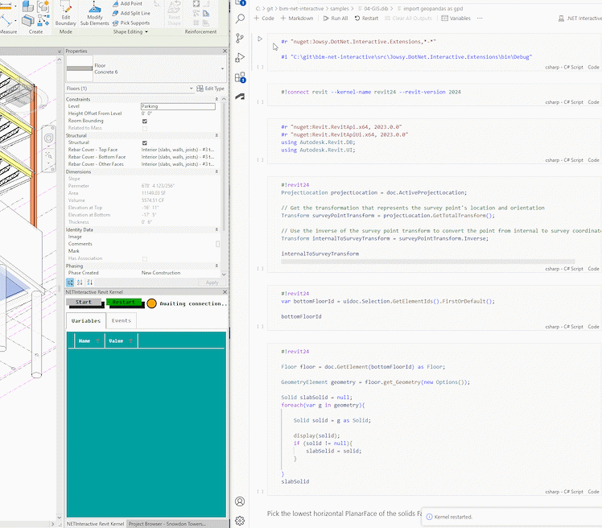

# Revit API Notebooks

This is a personal project that explores the possibility to run live Revit C#-scripts inside notebooks bundled with visualizations and narrative text. 

Install the Revit kernel extension in VSCode Polyglot Notebook using the #r directive.

```csharp
#r "nuget:Jowsy.DotNet.Interactive.Extensions"
```

Then connect at runtime to a running Revit application using #connect-directive. Specify Revit-version.
```csharp
#!connect revit --kernel-name revit24 --revit-version 2024
```

Then inside a code cell, execute the code inside Revit using a magic command for the kernel:

```csharp
#!revit24   
var collector = new FilteredElementCollector( doc, uidoc.ActiveView.Id);

var query = collector
        .WhereElementIsNotElementType()
        .WhereElementIsViewIndependent()
        .ToElements();

var result = query.GroupBy(x => x.Category.Name).Select(y => new {
    Id = y.Key,
    Count = y.Count()
}).ToList();

display(result);
result
```
## Examples

Extracting profile geometry from floor and export to shapefile for GIS-visualization using C# and Python (Shapely and Geopandas libraries).



## Aknowledgements and third-party dependencies

* Built on top of [NET Interactive](https://github.com/dotnet/interactive)
* Got a lot inspiration from [RevitAddinManager](https://github.com/chuongmep/RevitAddInManager) for how to configure csproj.
* Credit to Alexander Sharykin for his [https://github.com/jowsy/RetroUI](RetroUI) WPF theme (forked by me and adapted for use in a Revit addin).

## License

MIT