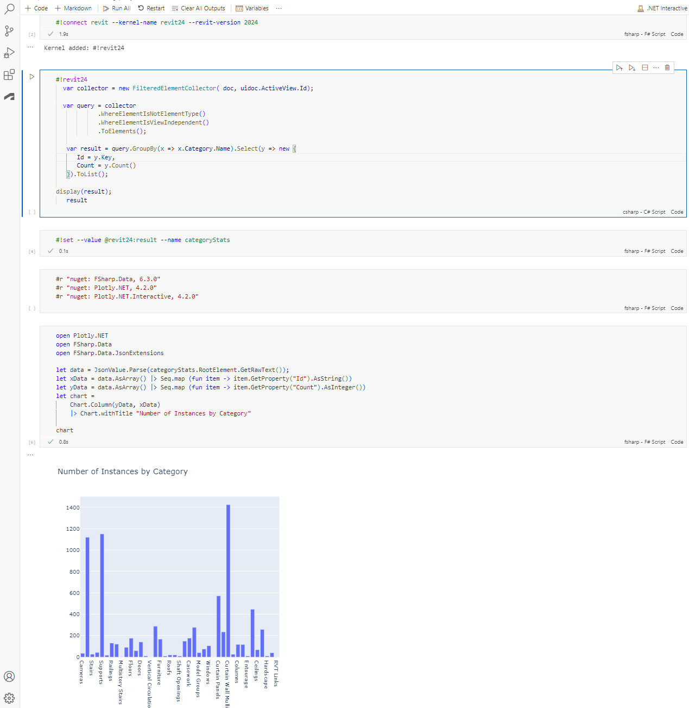

# Embedded NET Interactive Revit Kernel
**Bringing 📜Literary Programming to Autodesk Revit**

Run Autodesk Revit API code live with Visual Studio Code Polyglot Notebook extension.
The objective is to:
* Let users develop in their own thought patterns and reducing the otherwise quite high ceremony of setting up a Revit addin project in Visual Studio. 
* Act as a experimentation and learning tool for coding up short snippets or program units that finally can be composed into a larger program.
* Explore new possibilites with sharing between other language Kernels, for example Python in Jupyter.

> 💥 There is a third-party dll conflict between NET interactive and Autodesk BIM 360 Issues addin. In order to get the full experience you have to temporarily disable the BIM 360 Issues addin. Variable sharing will not work when the addin is enabled.

Supported languages:
- [x] C# (the scripting dialect, see [C# Scripting](https://learn.microsoft.com/en-us/archive/msdn-magazine/2016/january/essential-net-csharp-scripting))
- [ ] F#
- [ ] Python

### Prequisities
- [x] Git
- [x] VS Code
- [x] VS Code Polyglot Notebook Extension
- [x] Autodesk Revit 2024

## How to get started
1. Clone this repo
2. Install Polyglot Notebook extension to VS Code
2. Open VS Code and open folder /src as working directory.
3. Open /src/GetStarted.ipynb and take it from there.

## License

MIT
